# 战斗机介绍

小球对战里可选的对战单位。吃伤害、计入胜负。按选人页顺序。不写胜率。

五维都是 1–5，3 是这批里的中等：

- **生存**：作为战斗机留在场上。血量、减伤、闪避、回血、壳；拖到超时也算。
- **爆发**：短时间窗口内的造伤。击破伤害算入爆发。
- **稳定**：打法不靠运气、不靠特定窗口。不是巡航。
- **机动**：自己改位置。拉、推、墙、眩晕动的是别人，不抬自己的机动。
- **输出**：整场持续造伤。同一记可以同时算入输出和爆发。

- [分身者](#分身者)
- [内燃机](#内燃机)
- [钓鱼佬](#钓鱼佬)
- [地慧星](#地慧星)
- [小骑士](#小骑士)
- [原型机_近战](#原型机_近战)
- [面灵气](#面灵气)
- [囚徒](#囚徒)
- [雷达](#雷达)
- [原型机_远程](#原型机_远程)
- [收割者](#收割者)
- [无下限术士](#无下限术士)
- [优昙华院](#优昙华院)
- [筑墙者](#筑墙者)
- [盾士](#盾士)
- [狼人](#狼人)

## 分身者

观众能看见：灰蓝实心圆。本体和三颗分身一个颜色。

本体不出伤。开局身边三颗分身，各挂一圈细环刮人。挨打且未死时，和随机分身换位置。

生存 4 · 爆发 2 · 稳定 5 · 机动 3 · 输出 5

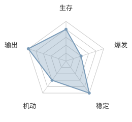

## 内燃机

观众能看见：边缘铁色、中心高温，档位越高中心越向外扩；6 档全烧红。球外一圈细槽是热力条。虚弱时整球变暗、停住。

热力条按时间自涨，满了升档，6 档满则击破。升档只改巡航和视野。普通攻击是自己的节拍；击破后站两秒，第 1 秒打击破伤害。造成的伤害不停帧。

生存 2 · 爆发 4 · 稳定 3 · 机动 3 · 输出 3

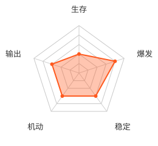

## 钓鱼佬

观众能看见：金黄圆，带暖色光。空军后光偏蓝；高速碰撞时更亮、更饱和。

不转向。开局场边三口鱼塘，踩进去站住才钓。空军加快走路巡航；第二次空军清掉边塘，场心铺一口盖满场地的鱼塘，之后飞着钓。够重的鱼先扛着跑，六条场边都撞过再甩出。

生存 3 · 爆发 4 · 稳定 1 · 机动 4 · 输出 3

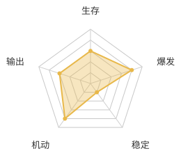

## 地慧星

观众能看见：天蓝色球，常驻故障切片。居合时球体带短刀光。

身前窄扇环叠剑痕，偶尔留下可穿过的故障残影。受击时若闪避就绪，无效该次攻击并瞬移到离敌人最远的角。撞场边会叠速度。稍后锁定蓄力，打出一条极宽的无限长斩击。

生存 4 · 爆发 5 · 稳定 2 · 机动 4 · 输出 4

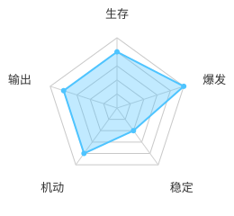

## 小骑士

观众能看见：鲜红实心圆，冲起来会留残影。

开局不满血。身前宽扇环一直挂着。每隔一段时间瞬移到敌人身边再冲撞，有时会立刻再来一次。

生存 2 · 爆发 5 · 稳定 4 · 机动 5 · 输出 4

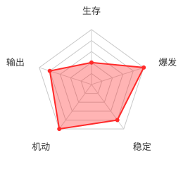

## 原型机_近战

观众能看见：青绿实心圆，带视野圈；超速时留冲刺残影。扇环张角会随减伤变宽。

敌人进入视野边沿就朝对方偏一点，并加速顶上去。身前扇环刮人。挨打时若比巡航快，按超出的速度减伤。

生存 3 · 爆发 2 · 稳定 2 · 机动 5 · 输出 3

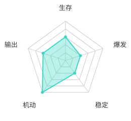

## 面灵气

观众能看见：球色自己在青、红、紫、苍之间转，不改别人颜色。槽位上挂派系图标。

最大生命比别人低。开局给自己和敌人各打一个派系；自己撞墙换派系。对异派系加伤，受同派系减伤。当前派系决定自己挂扇环、回血、射弹还是加速。凑齐四种朝四周打四发弹幕。

生存 2 · 爆发 3 · 稳定 2 · 机动 4 · 输出 3

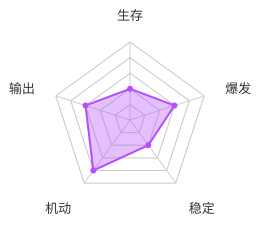

## 囚徒

观众能看见：圆球横向黑白条纹相间。钩爪钉上之后，两点之间是一节一节的锈铁链，松弛时挤在弦上，不垂下去弯。

不转向。开局没有钩爪，第一次撞场边才钉；砌在场上的墙不钉。锁链和球体都不出伤。按点落下囚笼、绞刑架、电椅。电流打中锁链则触电，巡航加倍。

生存 3 · 爆发 2 · 稳定 3 · 机动 4 · 输出 3

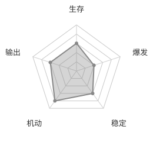

## 雷达

观众能看见：深绿磷光的圆球，不是碟。一条更亮的绿细线从球心伸出，顺时针转。

不转向，撞墙弹开。激光开局就有、一直转、不灭，穿墙。扫到敌方战斗机就结算。朝向不跟速度绑。

生存 2 · 爆发 1 · 稳定 5 · 机动 2 · 输出 4

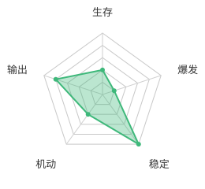

## 原型机_远程

观众能看见：暖橙实心圆。打出的弹同色，带拖尾。

看得见全场。有敌才射，子弹撞墙几次后消失。每开一枪，自己速度反向。

生存 2 · 爆发 2 · 稳定 4 · 机动 3 · 输出 3

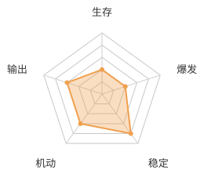

## 收割者

观众能看见：暗紫圆球。钉在场边上的是 2D 描边暗刃、刃口洋红的新月；出过伤之后整把变鲜红。

不转向。只在场边钉镰刀，砌在场上的墙不钉。刀打中不消失。六条场边都至少有一把，全部放大飞回本体；出过伤的碰到自己回血。

生存 4 · 爆发 3 · 稳定 3 · 机动 2 · 输出 4

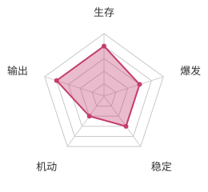

## 无下限术士

观众能看见：红、蓝两个半圆，中间有连线。红侧像在吸，蓝侧像在推。相撞时打出的紫弹很大、带拖尾。

开局裂成两半：红吸引、蓝推开，两半身前都挂扇环。红蓝碰到一起且看得见敌人时，从中点打一发紫弹，穿透敌人可反复结算。

生存 3 · 爆发 4 · 稳定 3 · 机动 3 · 输出 4

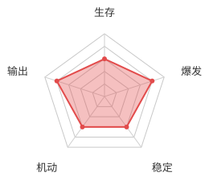

## 优昙华院

观众能看见：粉紫圆，带光。球外一圈细槽是灵力。

撞墙回灵力。空灵力挨打更痛；前方命中可耗灵力减伤。手里随时准备技能：散射、心弹裂碎、贴身断空、激光、分身连射、毒烟、花冠、服药。第四次服药会炸开。

生存 2 · 爆发 5 · 稳定 1 · 机动 2 · 输出 3

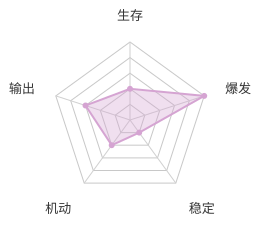

## 筑墙者

观众能看见：土黄实心圆。身前有一段瞄准虚线，和即将砌出的墙一样长。

按节拍在自己和敌人的中点砌胶囊墙。墙人人弹开，只刮敌方战斗机。自己不会瞬移、不会加速。

生存 4 · 爆发 1 · 稳定 4 · 机动 1 · 输出 2

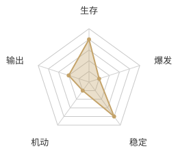

## 盾士

观众能看见：灰蓝实心圆，贴身一圈盾环。环碎时炸出碎片。

盾挡住伤害。盾碎或自己格挡时炸碎片。过一段时间，或累计挨打够了，再补盾。

生存 5 · 爆发 3 · 稳定 4 · 机动 2 · 输出 2

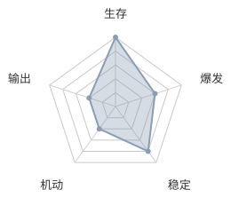

## 狼人

观众能看见：偏骨白的圆，带光。场心有一颗更大的浅金月亮。撕咬时球更亮、更红。

开局场心挂月亮。自己或敌人进入月亮，推进月相。满月进入撕咬：先站定锁敌，再连续冲墙。平时身前扇环；撕咬时换成更宽、更疼的撕咬弧。

生存 3 · 爆发 5 · 稳定 2 · 机动 5 · 输出 4

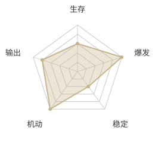
