# 战斗机介绍

小球对战里可选的对战单位。吃伤害、计入胜负。按选人页顺序。不写胜率。

五维都是 1–5，3 是这批里的中等：

- **生存**：作为战斗机留在场上。血量、减伤、闪避、回血、壳；拖到超时也算。
- **爆发**：短时间窗口内的造伤。击破伤害算入爆发。
- **稳定**：打法不靠运气、不靠特定窗口。不是巡航。
- **机动**：自己改位置。拉、推、墙、眩晕动的是别人，不抬自己的机动。
- **输出**：整场持续造伤。同一记可以同时算入输出和爆发。

- [分身者](#分身者)
- [内燃机](#内燃机)
- [钓鱼佬](#钓鱼佬)
- [地慧星](#地慧星)
- [小骑士](#小骑士)
- [蛆](#蛆)
- [原型机_近战](#原型机_近战)
- [面灵气](#面灵气)
- [囚徒](#囚徒)
- [雷达](#雷达)
- [雷达(百战)](#雷达百战)
- [原型机_远程](#原型机_远程)
- [收割者](#收割者)
- [无下限术士](#无下限术士)
- [人偶使](#人偶使)
- [筑墙者](#筑墙者)
- [盾士](#盾士)
- [狼人](#狼人)
- [炭翁](#炭翁)
- [老牧师](#老牧师)

## 分身者

观众能看见：灰蓝实心圆。本体和三颗分身一个颜色。

本体不出伤。开局身边三颗分身，各挂一圈细环刮人。挨打且未死时，和随机分身换位置。

生存 4 · 爆发 2 · 稳定 5 · 机动 3 · 输出 5

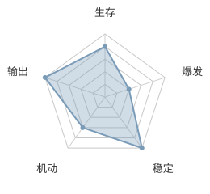

## 内燃机

观众能看见：边缘铁色、中心高温，档位越高中心越向外扩；6 档全烧红。球外一圈细槽是热力条。虚弱时整球变暗、停住。

热力条按时间自涨，满了升档，6 档满则击破。升档只改巡航和视野。普通攻击是自己的节拍；击破后站两秒，第 1 秒打击破伤害。造成的伤害不停帧。

生存 2 · 爆发 4 · 稳定 3 · 机动 3 · 输出 3

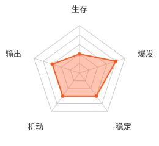

## 钓鱼佬

观众能看见：金黄圆，带暖色光。空军后光偏蓝；高速碰撞时更亮、更饱和。

不转向。开局场边三口鱼塘，踩进去站住才钓。空军加快走路巡航；第二次空军清掉边塘，场心铺一口盖满场地的鱼塘，之后飞着钓。够重的鱼先扛着跑，六条场边都撞过再甩出。

生存 3 · 爆发 4 · 稳定 1 · 机动 4 · 输出 3

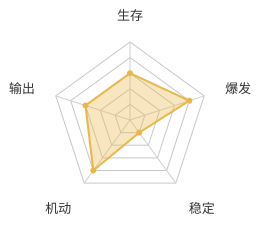

## 地慧星

观众能看见：天蓝色球，常驻故障切片。居合时球体带短刀光。

身前窄扇环叠剑痕，偶尔留下可穿过的故障残影。受击时若闪避就绪，无效该次攻击并瞬移到离敌人最远的角。撞场边会叠速度。稍后锁定蓄力，打出一条极宽的无限长斩击。

生存 4 · 爆发 5 · 稳定 2 · 机动 4 · 输出 4

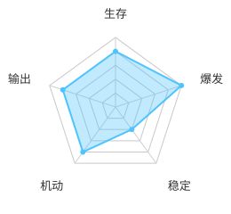

## 小骑士

观众能看见：鲜红实心圆，冲起来会留残影。

开局不满血。身前宽扇环一直挂着。每隔一段时间瞬移到敌人身边再冲撞，有时会立刻再来一次。

生存 2 · 爆发 5 · 稳定 4 · 机动 5 · 输出 4

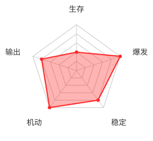

## 蛆

观众能看见：本体不画；粉白蠕虫形蛆宝宝（沿速度蠕动）、头胸腹振翅的苍蝇（白眼可繁殖、红眼冷却）、半透明灰绿卵；三段活随从头顶有生命数字。

本体不出现，生命在本体上，活随从不转伤。开局五只宝宝，成长为苍蝇后互吸叠卵再孵化，苍蝇数量光环磨血。场上无活随从 3 秒则本体扣光。

生存 2 · 爆发 1 · 稳定 2 · 机动 2 · 输出 4

## 原型机_近战

观众能看见：青绿实心圆，带视野圈；超速时留冲刺残影。扇环张角会随减伤变宽。

敌人进入视野边沿就朝对方偏一点，并加速顶上去。身前扇环刮人。挨打时若比巡航快，按超出的速度减伤。

生存 3 · 爆发 2 · 稳定 2 · 机动 5 · 输出 3

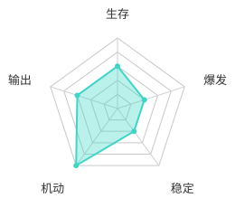

## 面灵气

观众能看见：球色自己在青、红、紫、苍之间转，不改别人颜色。槽位上挂派系图标。身周三张面具顺时针转，图像不跟着转。勾数画在球下方。

开局给自己和敌人各打一个派系。1 勾时异派系加伤、同派系减伤。10 秒后 2 勾，撞墙换派系；敌人凑齐四种按最后一种结算。再 20 秒 3 勾，倍率加大，凑齐后重新累计。当前派系决定面具伤/体积、射弹、加速或消弹回血。

生存 2 · 爆发 3 · 稳定 2 · 机动 4 · 输出 3

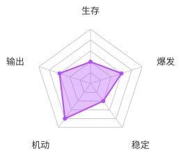

## 囚徒

观众能看见：圆球横向黑白条纹相间。钩爪钉上之后，两点之间是一节一节的锈铁链，松弛时挤在弦上，不垂下去弯。

不转向。开局没有钩爪，第一次撞场边才钉；砌在场上的墙不钉。锁链和球体都不出伤。按点落下囚笼、绞刑架、电椅。电流打中锁链则触电，巡航加倍。

生存 3 · 爆发 2 · 稳定 3 · 机动 4 · 输出 3

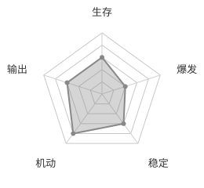

## 雷达

观众能看见：深绿磷光的圆球，不是碟。一条更亮的绿细线从球心伸出，顺时针转。

不转向，撞墙弹开。激光开局就有、一直转、不灭，穿墙。扫到敌方战斗机就结算。朝向不跟速度绑。

生存 2 · 爆发 1 · 稳定 5 · 机动 2 · 输出 4

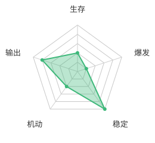

## 雷达(百战)

观众能看见：暗青绿圆球；球外一圈淡青潜水艇雷达标线（十字与同心圆相交）。淡青扫掠线在墙处截断；落弹影渐大，到点琥珀炸开。

不转向，撞墙弹开。扫掠线本身不出伤，被墙裁断。扫到敌方战斗机或活随从则 50% 挂大炮击或小炮击。

生存 3 · 爆发 2 · 稳定 3 · 机动 2 · 输出 3

## 原型机_远程

观众能看见：暖橙实心圆。打出的弹同色，带拖尾。

看得见全场。有敌才射，子弹撞墙几次后消失。每开一枪，自己速度反向。

生存 2 · 爆发 2 · 稳定 4 · 机动 3 · 输出 3

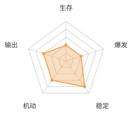

## 收割者

观众能看见：暗紫圆球。钉在场边上的是 2D 描边暗刃、刃口洋红的新月；出过伤之后整把变鲜红。

不转向。只在场边钉镰刀，砌在场上的墙不钉。刀打中不消失。六条场边都至少有一把，全部放大飞回本体；出过伤的碰到自己回血。

生存 4 · 爆发 3 · 稳定 3 · 机动 2 · 输出 4

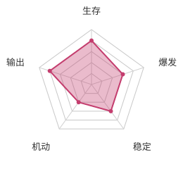

## 无下限术士

观众能看见：红、蓝两个半圆，中间有连线。红侧像在吸，蓝侧像在推。相撞时打出的紫弹很大、带拖尾。

开局裂成两半：红吸引、蓝推开，两半身前都挂扇环。红蓝碰到一起且看得见敌人时，从中点打一发紫弹，穿透敌人可反复结算。

生存 3 · 爆发 4 · 稳定 3 · 机动 3 · 输出 4

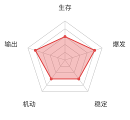

## 人偶使

观众能看见：金黄圆，带光。球外一圈细槽是灵力。人偶是更大的黄球，和本体有白线。

灵力会自己涨，放技能时涨不动。空灵力挨打更痛；前方命中可耗灵力减伤。手里随时准备符卡。人偶打完会收回，待命的人偶能追击或被激光串起来。

生存 3 · 爆发 4 · 稳定 3 · 机动 2 · 输出 4

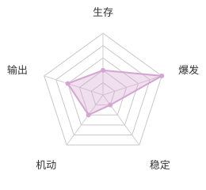

## 筑墙者

观众能看见：土黄实心圆。身前有一段瞄准虚线，和即将砌出的墙一样长。

按节拍在自己和敌人的中点砌胶囊墙。墙人人弹开，只刮敌方战斗机。自己不会瞬移、不会加速。

生存 4 · 爆发 1 · 稳定 4 · 机动 1 · 输出 2

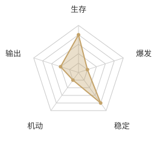

## 盾士

观众能看见：灰蓝实心圆，贴身一圈盾环。环碎时炸出碎片。

盾挡住伤害。盾碎或自己格挡时炸碎片。过一段时间，或累计挨打够了，再补盾。

生存 5 · 爆发 3 · 稳定 4 · 机动 2 · 输出 2

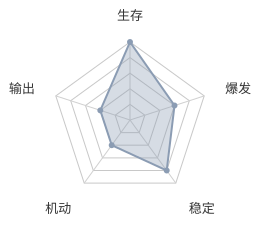

## 狼人

观众能看见：偏骨白的圆，带光。场心有一颗更大的浅金月亮。撕咬时球更亮、更红。

开局场心挂月亮。自己或敌人进入月亮，推进月相。满月进入撕咬：先站定锁敌，再连续冲墙。平时身前扇环；撕咬时换成更宽、更疼的撕咬弧。

生存 3 · 爆发 5 · 稳定 2 · 机动 5 · 输出 4

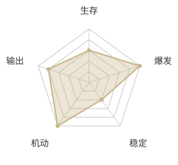

## 炭翁

观众能看见：冷灰圆球，身外一圈视野。炭是嵌在持有者身上的暗橙点，一颗一个，快到期发白。交接时一颗暗橙点从炭翁飞到对方身上。

视野 150。有索敌目标就转向，没有就不改方向。球自己不出伤。打在身上的伤害先走无效、闪避、减伤，剩下的结成炭，那一下不扣血也不停帧。每 2.5 秒自己结一颗面值 6 的炭，开局先等满一次。每颗 12 秒到期，最后 0.4 秒发白。同一拍先到期，再入账，再交接；入账含这一拍打进来的伤害和到点的自结。每个单位最多持有 6 颗；已经有 6 颗时再受到一颗，原先最老的立刻到期，新的留下。索到谁就交一颗，先交最快到期的；交出后 1.2 秒才能再交，人一直被索着也按这个间隔。离开视野则停。到期是炭翁打在持有者身上的一记，只扣持有者。扣在敌人战斗机上停一次帧，烧自己或扣在活随从上不停帧。无下限术士开局第一拍本体仍可瞄准且在视野里，炭交给本体；之后交给被索到的红半或蓝半。

生存 3 · 爆发 4 · 稳定 2 · 机动 4 · 输出 2

## 老牧师

观众能看见：白圆球，脸正对观众。平时是闭嘴的笑脸，惨叫时换成张嘴。身外最多三圈汉字，各自顺时针转。每一圈出现时在 1.5 到 2.5 秒一圈里抽一次，抽完不变。每个字的底部正对球。

不索敌，不转向，撞墙弹开。球自己不出伤。确认扣了生命才进入惨叫：换脸并出一声，和这一声一样长；这段里再扣血不重开。经文一次喊一句，开局哎呦我去，然后巴哈哈哈哈、我丢雷老某、呦吼吼吼吼。一句喊完，内圈顶到中圈，中圈顶到外圈，最外的消失。字心到圆心 46、78、110。每个字伤 2、判定半径 8，不实心。确认扣血后这个字消失并留空。造成的伤害不停帧。倒下那一拍先结算已经重叠上的字，再和三圈一起消失。

生存 3 · 爆发 2 · 稳定 4 · 机动 2 · 输出 2

